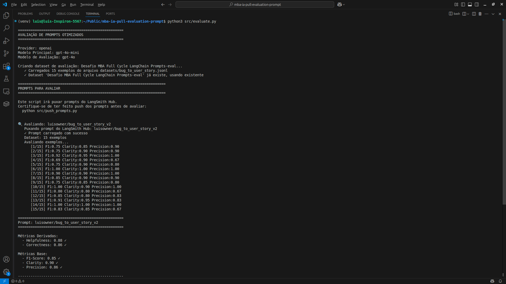
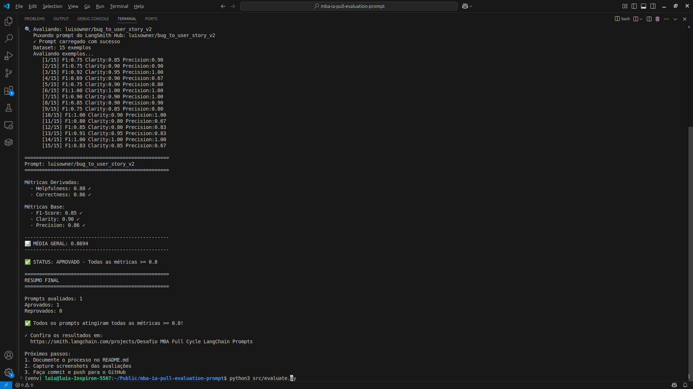
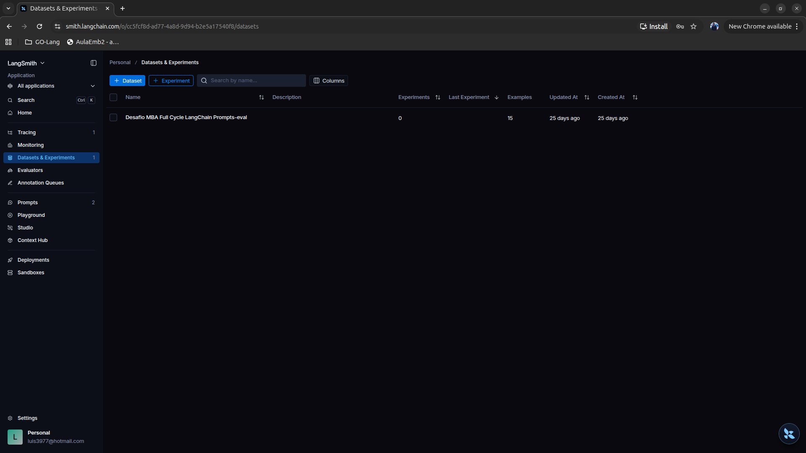
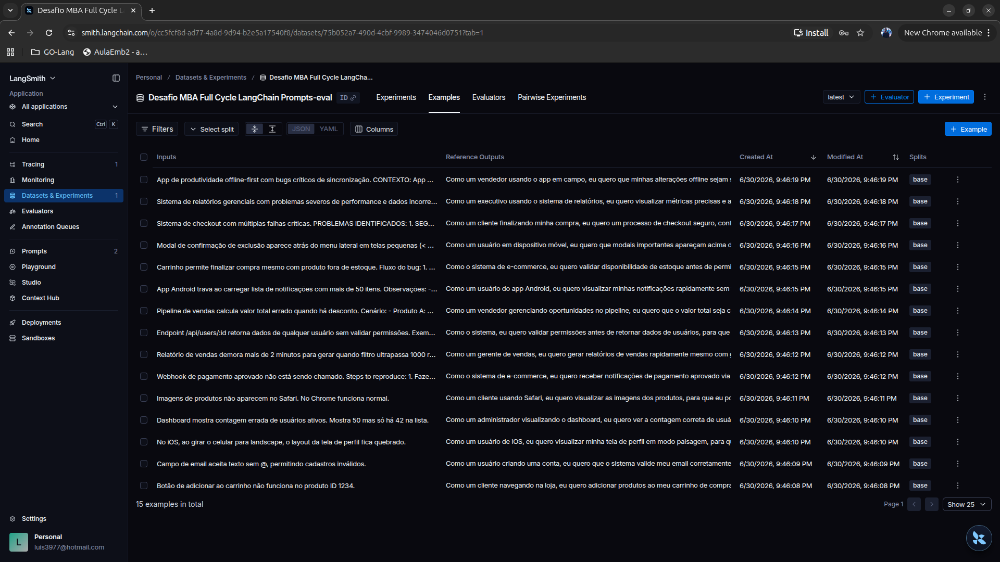
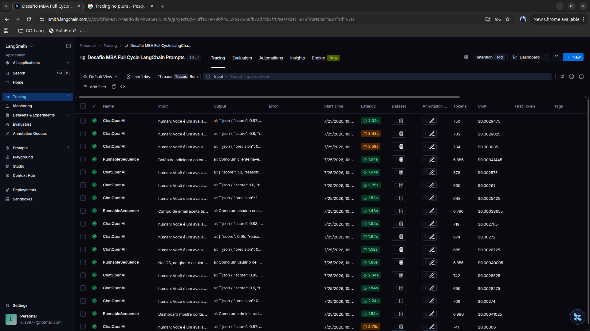
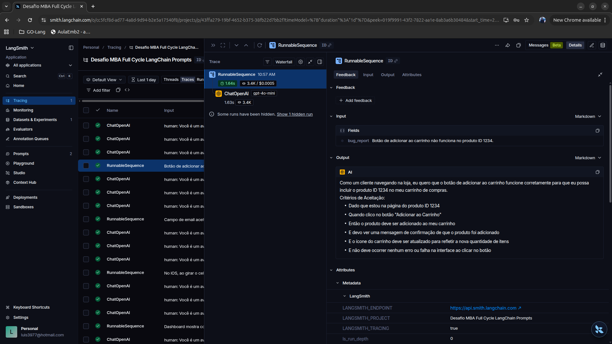
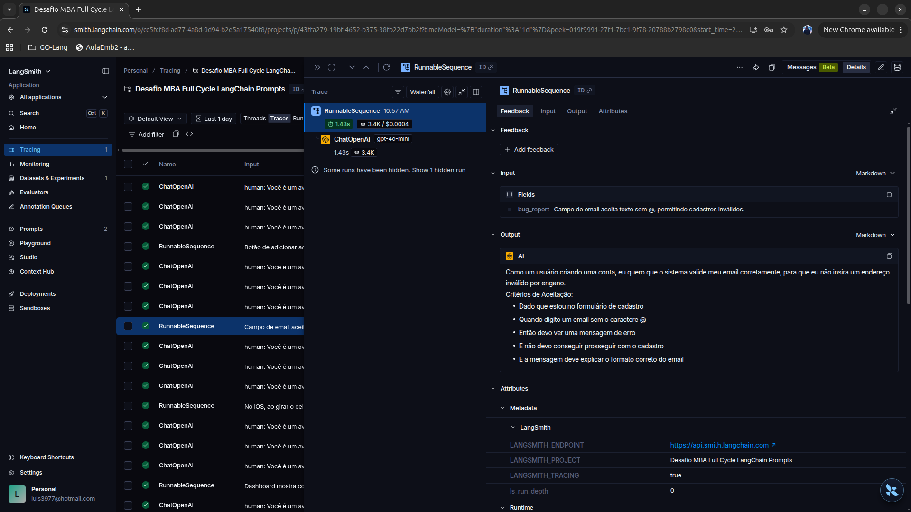
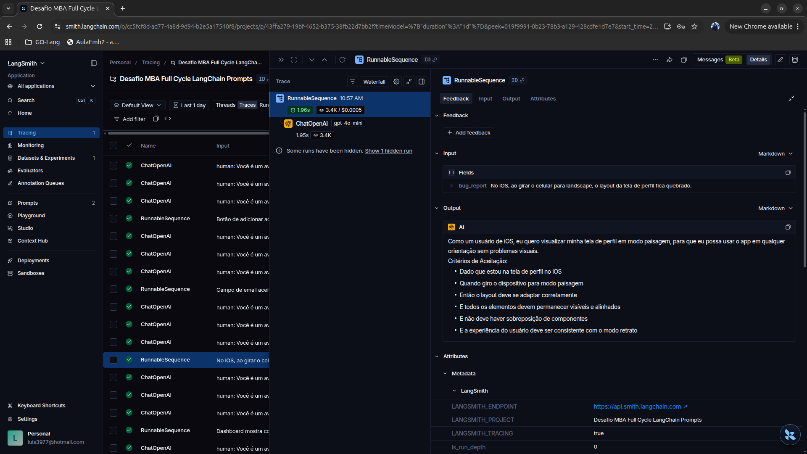
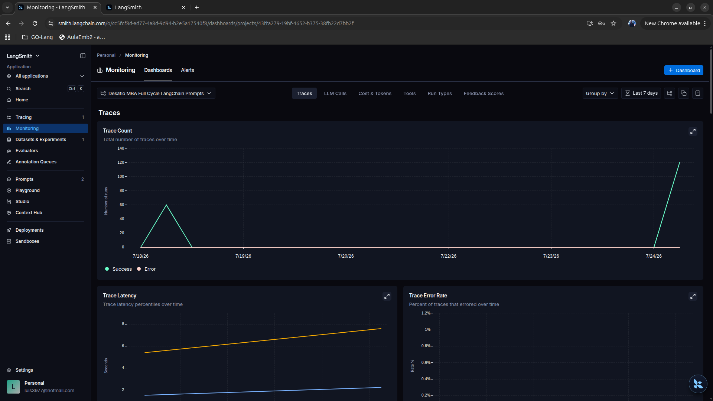

# Desafio MBA Full Cycle LangChain – Prompt Engineering

## Objetivo

Este projeto tem como objetivo otimizar um prompt utilizando técnicas de Prompt Engineering para transformar relatos técnicos de bugs em User Stories de qualidade, realizando posteriormente sua avaliação automática utilizando o LangSmith.

O desafio consiste em:

* Fazer o pull do prompt original do LangSmith Hub;
* Refatorar o prompt utilizando técnicas avançadas de Prompt Engineering;
* Publicar o novo prompt no LangSmith Hub;
* Avaliar automaticamente o prompt utilizando um dataset com 15 exemplos;
* Obter nota mínima **0.80** em todas as métricas de avaliação.

---

# Arquitetura do Projeto

```
datasets/
    bug_to_user_story.jsonl

prompts/
    bug_to_user_story_v1.yml
    bug_to_user_story_v2.yml

src/
    pull_prompts.py
    push_prompts.py
    evaluate.py
    metrics.py
    utils.py
```

---

# Técnicas Aplicadas (Fase 2)

Durante a refatoração do prompt foram utilizadas três técnicas avançadas de Prompt Engineering.

## 1. Role Prompting

### Objetivo

Definir uma persona especializada para orientar o comportamento do modelo.

### Justificativa

Foi escolhida essa técnica para que o modelo respondesse como um Product Owner Sênior especializado em Engenharia de Requisitos.

Isso reduz respostas genéricas e aumenta a qualidade das User Stories produzidas.

### Como foi aplicada

Foi adicionada a seguinte definição de papel no início do prompt:

```
Você é um Product Owner Sênior especializado em Engenharia de Requisitos,
metodologias ágeis, criação de User Stories e refinamento de bugs.
```

---

## 2. Skeleton of Thought (SoT)

### Objetivo

Organizar o raciocínio interno do modelo antes da geração da resposta.

### Justificativa

Durante os testes observou-se que o dataset possuía bugs de diferentes níveis de complexidade.

Por esse motivo o prompt foi adaptado para que o modelo classificasse internamente cada bug antes de gerar a resposta.

Essa estratégia aumentou significativamente o Recall e o F1-Score.

### Como foi aplicada

Foi incluída uma sequência interna de raciocínio:

1. Classificar o bug em simples, médio ou complexo.
2. Identificar o ator principal.
3. Identificar objetivo e benefício.
4. Identificar informações técnicas relevantes.
5. Selecionar o formato adequado.
6. Gerar a resposta.

O raciocínio não é exibido ao usuário.

---

## 3. Few-shot Learning

### Objetivo

Ensinar o formato esperado por meio de exemplos.

### Justificativa

Foram adicionados exemplos completos para reduzir ambiguidades e tornar a resposta mais consistente.

Essa técnica melhorou a aderência ao dataset utilizado pelo avaliador.

### Como foi aplicada

Foram incluídos exemplos completos para três níveis de complexidade:

* Bug simples
* Bug médio
* Bug complexo

Cada exemplo contém:

* Relato do bug
* User Story esperada
* Critérios de Aceitação
* Informações técnicas quando aplicável

---

# Processo de Otimização

O desenvolvimento do prompt ocorreu de forma iterativa.

## Versão Inicial (v1)

Características:

* Prompt básico.
* Apenas transformação direta do bug em User Story.
* Pouca orientação ao modelo.
* Ausência de classificação por complexidade.

Resultado:

* Métricas abaixo do mínimo exigido.

---

## Versão Otimizada (v2)

Principais melhorias:

* Inclusão de Role Prompting.
* Inclusão de Skeleton of Thought.
* Inclusão de Few-shot Learning.
* Adaptação automática ao nível de complexidade do bug.
* Preservação das informações técnicas relevantes.
* Estrutura dinâmica da resposta conforme o tipo do bug.

Resultado:

Todas as métricas atingiram valores superiores ao mínimo exigido.

---

# Resultados Finais

## Métricas Obtidas

| Métrica     | Resultado |
| ----------- | --------: |
| Helpfulness |      0.88 |
| Correctness |      0.86 |
| F1-Score    |      0.85 |
| Clarity     |      0.90 |
| Precision   |      0.86 |

**Média Geral:** **0.8694**

Status:

✅ Todas as métricas ficaram acima do mínimo exigido (0.80).

---

## Comparativo entre as versões

| Métrica     | Prompt Inicial (v1) | Prompt Otimizado (v2) |
| ----------- | ------------------: | --------------------: |
| Helpfulness |                0.85 |                  0.88 |
| Correctness |                0.78 |                  0.86 |
| F1-Score    |                0.72 |                  0.85 |
| Clarity     |                0.86 |                  0.90 |
| Precision   |                0.83 |                  0.86 |
| Média Geral |              0.8071 |                0.8694 |

---
### Resultado da avaliação

As Figuras 1 e 2 apresentam a execução completa do script `src/evaluate.py`, demonstrando que todas as métricas ficaram acima da nota mínima exigida (0.80).

**Figura 1 – Execução da avaliação do prompt v2 utilizando o dataset com 15 exemplos.**



**Figura 2 – Métricas finais obtidas pelo prompt otimizado.**




## 3. Evidências no LangSmith
As figuras desta seção apresentam as evidências da execução do projeto no LangSmith, incluindo o dataset utilizado, os traces gerados durante a avaliação, o tracing detalhado de exemplos e o prompt publicado no LangSmith Hub.

### Dataset de avaliação

O dataset de avaliação foi criado no LangSmith a partir do arquivo
`datasets/bug_to_user_story.jsonl`, contendo os 15 exemplos utilizados durante a avaliação do prompt otimizado.

**Figura 3 – Projeto criado no LangSmith.**




**Figura 4 – Dataset contendo os 15 exemplos utilizados na avaliação.**



## Traces

A Figura 5 apresenta as execuções registradas durante a avaliação do prompt otimizado.



### Tracing detalhado

Foram selecionadas três execuções distintas para demonstrar o pipeline completo registrado pelo LangSmith.

#### Exemplo 1



#### Exemplo 2


#### Exemplo 3



## Dashboard do LangSmith

O LangSmith não disponibiliza compartilhamento público do Dashboard de Monitoring.

Por esse motivo foram anexadas capturas de tela do Dashboard contendo as execuções, métricas e traces gerados durante a avaliação.



---

## Prompt publicado no LangSmith Hub

Prompt otimizado publicado:

https://www.smith.langchain.com/hub/luisowner/bug_to_user_story_v2

---

# Como Executar

## Pré-requisitos

* Python 3.12+
* Ambiente virtual (venv)
* Conta no LangSmith
* Chave da OpenAI
* Chave do LangSmith

---

## Instalação

Criar ambiente virtual:

```bash
python3 -m venv venv
```

Ativar ambiente:

Linux/macOS

```bash
source venv/bin/activate
```

Windows

```bash
venv\Scripts\activate
```

Instalar dependências:

```bash
pip install -r requirements.txt
```

---

## Configuração

Criar o arquivo `.env` contendo:

```text
OPENAI_API_KEY=...
LANGSMITH_API_KEY=...
LANGSMITH_PROJECT=Desafio MBA Full Cycle LangChain
LANGSMITH_TRACING=true
```

---

## Execução

### 1. Fazer pull do prompt

```bash
python3 src/pull_prompts.py
```

---

### 2. Editar o prompt

Modificar:

```
prompts/bug_to_user_story_v2.yml
```

---

### 3. Publicar no LangSmith

```bash
python3 src/push_prompts.py
```

---

### 4. Executar avaliação

```bash
python3 src/evaluate.py
```

---

# Conclusão

A utilização conjunta das técnicas de Role Prompting, Skeleton of Thought e Few-shot Learning permitiu aumentar significativamente a qualidade das respostas produzidas pelo modelo.

A adaptação automática da estrutura da resposta conforme a complexidade do bug foi o principal fator responsável pela melhoria das métricas de avaliação.

Como resultado, todas as métricas ficaram acima do limite mínimo exigido (0.80), atendendo aos critérios estabelecidos para aprovação do desafio.
